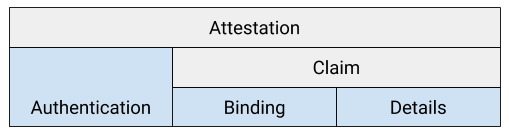

# ITE-6: Generalized link format

Author: lodato@

Contributors/reviewers: dedic@, nitinjain@, patricklawson@, tomhennen@

Date: September 2020

# Abstract

This ITE defines a new schema for in-toto link files, which are now generally called “attestations.” An attestation has three distinct layers, mapping to the three distinct steps in verification. The innermost layer is user-defined to allow customers to define their own schemas; “link” is now one such user-defined schema.

This specification is developed jointly with [Binary Authorization](https://cloud.google.com/binary-authorization), who will support the agreed-upon format once finalized. This way a single link file will be usable by either system.


# Specification


## Introduction

An **attestation** is the generalization of an in-toto link. It is a statement about an artifact, signed by an attester. Each attestation has a type indicating what the statement means, plus type-dependent details. In this new model, a “link” is just one type of attestation, but others are possible.

Examples of attestations:


*   Provenance: GitHub Actions attests to the fact that it built a container image with digest “sha256:87f7fe…” from git commit “f0c93d…” in the “master” branch of “https://github.com/example/foo”.
*   Code review: GitHub attests to the fact that Alice uploaded and Bob approved git commit “f0c93d…” in the “master” branch of “https://github.com/example/foo”.
*   Test result: Google Container Analysis attests to the fact that no vulnerabilities were found in container image “sha256:87f7fe…” at a particular time.
*   Policy decision: Binary Authorization attests to the fact that container image “sha256:87f7fe…” is allowed to run under GKE project “example-project” within the next 4 hours, and that it used the three attestations above and as well as the policy with sha256 hash “79e572”.


## Model and Terminology

An attestation has three layers, corresponding to the three logic steps in verifying an attestation:


*   **Authentication**: Ensures authenticity and integrity of the attestation. Handles:
    *   Who signed the attestation.
    *   How to interpret the next layer (serialization).
*   **Binding**: Ensures that the attestation is relevant for the verification context. Handles:
    *   What this attestation means, via a type ID.
    *   What artifacts this attestation is about.
*   **Details**: Additional data, specified with a type-dependent schema.

The binding and details together are called the **claim**.



## Authentication and serialization

[ITE-5](https://github.com/MarkLodato/ITE/blob/ite-5/ITE/5/README.md) defines a new, generic authentication layer. Attestations always use one of:


*   payloadType “https://in-toto.io/Attestation/v1-json” with a JSON-encoded payload.
*   payloadType “https://in-toto.io/Attestation/v1-cbor” with a CBOR-encoded payload.

The schema for the payload is described in [Claim schema (binding layer)](#claim-schema-binding-layer).

Prior to ITE-5, the existing in-toto signature wrapper may be used. In this case, the payload is always JSON with a `_type` of  “https://in-toto.io/Attestation/v1”.


## Claim schema (binding layer)

A claim is a JSON or CBOR object corresponding to the binding layer. It contains the following fields. See subsequent sections for [Type definitions](#type-definitions) and [Reasoning](#reasoning).

`attestation_type` _(URI, required)_


> Indicates the meaning of this attestation and how to interpret `details` and `relations`. Example:


```
"attestation_type": "https://example.com/Provenance/v1"
```


<code>subject<em> (ArtifactReference, recommended)</em></code>


    Identifies what software artifact this attestation is about. Example:


```
"subject": {"sha256": "728f71…"}
```


    If unset, the subject is unspecified. This is discouraged and only exists for backwards compatibility and for very rare cases where a single subject does not make sense. Such attestations may not be supported by BinAuthz.


    Subject always refers to a single artifact (see [reasoning](#reasoning)). If multiple subjects are desired, either:

*   Output one attestation per subject.
*   Create a single artifact that encapsulates all other artifacts, such as an archive or hash tree. Then refer to this new artifact as the subject.
*   (discouraged) Define a custom artifact reference type with whatever semantics are needed.

<code>relations<em> (Map&lt;string, Set&lt;Object>>, optional)</em></code>


    Identifies software artifacts related to `subject`. The map key indicates the relationship type and the value contains the set of software artifacts having that relation. Example:


```
"relations": {
  "top_level_source": [{
      "artifact": {"sha256": "a6a63f…"},
      "filename": "grep_2.12-2.dsc"
    }],
  "dependent_sources": [{
      "artifact": {"sha256": "37887d…"},
      "filename": "grep_2.12-2.debian.tar.bz2"
    }, {
      "artifact": {"sha256": "011998…"},
      "filename": "grep_2.12.orig.tar.bz2"
    }],
  "tools": [{
      "artifact": {"sha256": "1234…"},
      "filename": "gcc"
    }]
}
```


    The meaning of the key is dependent on `attestation_type`. Each set value is an _Object_ representing a single software artifact. The schema is dependent on `attestation_type` and can contain arbitrary metadata, but it must always have at least the following field:


    `artifact` _(ArtifactReference, required)_


        Identifies the related software artifact.


    The following standard relations are recommended[^1]:


*   `top_level_source`: The primary input used to generate this attestation or subject, each of which is independent. Usually length one. In the example, the “dsc” file is the top-level source because it fully specifies the build.
*   `dependent_sources`: Additional inputs used to generate this attestation or subject, referenced by at least one `top_level_source`. In the example, the two “tar.bz2” files are dependent because they are listed in the “dsc” file.
*   `tools`: Build tools, compilers, or other dependencies that would not be considered “source”.
*   `environment`: Artifacts in the operating system that can influence the build but that don’t meet the definitions above.
*   `other_products`: Other artifacts that were produced as part of the same build.

    **Alternate designs:**

1. Map&lt;string, Set&lt;ArtifactReference>>, where ArtifactReference can contain arbitrary metadata, not just immutable IDs. May need something to avoid clashes between standard fields (e.g. “sha256”) and custom ones. Pro: simpler to describe. Con: possibly more error prone.
2. Map&lt;string, Map&lt;string, ArtifactReference>>, where the outer map is the same and the inner map is `attestation_type`-dependent, usually filename. Pro: simpler than above. Con: users are forced to pick exactly one type of metadata for the map key, with no ability to add other types of metadata.
3. Set&lt;Object>, where the relationship type is a standard field, e.g. `relation`. Pro: more extensible. Con: harder to iterate over.

<code>details<em> (Object, optional)</em></code>


    Contains the details in an `attestation_type`-dependent schema. Unset is equivalent to set-but-empty. The binding layer treats this as opaque. Example:


```
"details": {
  "build_timestamp": "2020-04-12T01:23:45Z",
  "arch": "amd64"
}
```


The following are only needed for backwards compatibility:

<code>_type<em> (URI, optional)</em></code>


    Indicates that this message is an attestation, with the exact value “https://in-toto.io/Attestation/v1.” Only needed prior to [ITE-5](https://github.com/in-toto/ITE/pull/13). If this field is set, verifiers **must** reject the attestation if the value differs.


## Link schema (details layer)

Going forward, it is expected that most applications will use a custom attestationType with its own schema rather than relying on a generic Link schema.

That said, we define a backwards compatible Link format that is isomorphic with the old format and supported by existing layouts:


<table>
  <tr>
   <td><strong>Old Field Name</strong>
   </td>
   <td><strong>New Field Name</strong>
   </td>
  </tr>
  <tr>
   <td><code>_type = "link"</code>
   </td>
   <td><code>attestationType = "https://in-toto.io/Link/v1"</code>
   </td>
  </tr>
  <tr>
   <td><code>materials[&lt;key>] = &lt;value></code>
   </td>
   <td><code>relations.materials[&lt;index>]</code>
<p>
<code>  .filename = &lt;key></code>
<p>
<code>  .artifact = &lt;value></code>
   </td>
  </tr>
  <tr>
   <td><code>products[&lt;key>] = &lt;value></code>
   </td>
   <td><code>relations.products[&lt;index>]</code>
<p>
<code>  .filename = &lt;key></code>
<p>
<code>  .artifact = &lt;value></code>
   </td>
  </tr>
  <tr>
   <td><code>name</code>
   </td>
   <td><code>details.name</code>
   </td>
  </tr>
  <tr>
   <td><code>command</code>
   </td>
   <td><code>details.command</code>
   </td>
  </tr>
  <tr>
   <td><code>byproducts</code>
   </td>
   <td><code>details.byproducts</code>
   </td>
  </tr>
  <tr>
   <td><code>environment</code>
   </td>
   <td><code>details.environment</code>
   </td>
  </tr>
</table>


## Type definitions

_Object_


    A JSON/CBOR object whose schema depends on `attestation_type`.

_Map&lt;string, ValueType>_


    A JSON/CBOR object with arbitrary keys and whose values have the specified type.

_Set&lt;ValueType>_


    A JSON/CBOR array where each element has the specified type and order is not meaningful.

_URI_


    A string containing a Uniform Resource Identifier as specified in [RFC 3986](https://tools.ietf.org/html/rfc3986), used as a collision-resistant identifier. Case sensitive and **must** be case normalized as per section 6.2.2.1 of RFC 3986, meaning that the scheme and host must be in lowercase. Needs not be resolvable; if it is, the result **should** be a human-readable description of the schema. **Should** include a version number to allow for revisions to the schema. Example: “https://in-toto.io/Attestation/v1”.

_ArtifactReference_


    A map of immutable identifiers for a single software artifact. Each key/value pair is an alternate identifier for the same artifact, where the key indicates the type of the identifier. An artifact matches the reference if _any_ of its identifiers match. Example: `{"sha256": "abcd…", "sha512": "1234…"}` means an artifact whose content hash is either SHA-256 `abcd…` or SHA-512 `1234…`. Previously called a “hash object.”


    A set of [well-known types](#well-known-artifact-reference-types) cover the most common content hashes. All well-known types have a key in snake\_case (lower alphanumeric + underscore, starting with a letter) and a value encoded as a lowercase hex string.

    Custom types may be used to either define custom artifact IDs or custom semantics. For example, this may be used to support permalinks to an organization’s centralized version control system. Another example is to define “and” semantics, where all IDs must match. All custom-type keys **must** start with an underscore or be a _URI_ (thus containing a colon). The value can be any type, such as an array or object. The key is case sensitive.


# Well-known artifact reference types

List of planned well-known types, which are all pure content hashes and all represented as lowercase hex strings.


*   Generic cryptographic content hash of a blob of data (**bold** = recommended):
    *   sha224, **sha256**, sha384, **sha512**, sha512\_224, sha512\_256
    *   sha3\_224, sha3\_256, sha3\_384, sha3\_512
    *   shake\_128, shake\_256
    *   blake2b, blake2s
    *   md5 (discouraged)
    *   sha1 (discouraged)
*   Application-specific cryptographic content hash:
    *   container\_image\_digest
    *   git\_commit
    *   hg\_changeset

Open question: Should we define well-known types that are not pure content hashes? Ideas:


*   cpe ([Common Platform Enumeration](https://nvd.nist.gov/products/cpe))
    *   Example: `"cpe:2.3:a:gnu:gcc:2.95.1:…"`
    *   Pro: Could be useful for recording [CVE Entries](https://en.wikipedia.org/wiki/Common_Vulnerabilities_and_Exposures).
    *   Pro: Could be useful as a “source” in a provenance attestation (i.e. not subject).
    *   Con: Goes against monotonicity principle. Instead, we recommend an attestation saying “zero CVEs”.
    *   Con: Goes against our idea for binding attestations to particular artifacts. This, on the other hand, is more of a matcher.
*   git\_repo (git URL and optionally branch)
    *   Example: `"{ url: "https://github.com/curl/curl", branch: "master" }`
    *   Pro: Could be used to, for example, say that a particular repo was configured in a certain way, e.g. had code review enabled.
    *   Pro: Could be useful as a “source” in a provenance attestation (i.e. not subject).
    *   Con: Not an immutable reference to a software artifact.


## Notes

Attestations **should** be designed to encourage policies to be "monotonic," meaning that deleting an attestation will never turn a DENY decision into an ALLOW. One reason for this is because verifiers must ignore unrecognized subjects; if no subject is recognized, the attestation is effectively deleted. Example: instead of “deny if a ‘has vulnerabilities’ attestation exists”, prefer “deny unless a ‘no vulnerabilities’ attestation exists”.

Attestation designers are free to limit what subject types are valid for a given attestation type. For example, suppose a “Gerrit code review” attestation only applies to “git\_commit” subjects. In that case, a producer of such attestations should never use a subject other than “git\_commit.”


# Examples


## Link-type attestation

Links can be mechanically translated to the new format, without a `subject`. This doesn’t take advantage of the new features, but it does provide backwards compatibility with existing layouts.


```
{
  "attestation_type": "https://in-toto.io/Link/v1",
  "relations": {
    "products": [{
      "filename": "foo.tar.gz",
      "artifact": { "sha256": "78a73f2e55ef15930b137e43b9e90a0b..." }
    }],
    "materials": [{
      "filename": "foo.py",
      "artifact": { "sha256": "2a0ffef5e9709e6164c629e8b31bae0d..." }
    }]
  },
  "details": {
    "name": "package",
    "command": "tar zcvf foo.tar.gz foo.py",
    "byproducts": { … },
    "environment": { … }
  }
}
```


## Custom-type attestations

In many cases, custom-type attestations would be a more natural fit, as shown below. Such custom attestations are not yet supported by in-toto because the layout format has no way to reference such attestations. Still, we show the examples to explain the benefits for the new link format.

The initial step is often to write code. This has no materials and no real command. The existing Link schema has little benefit. Instead, a custom `attestation_type` would avoid all of the meaningless boilerplate fields. This example also shows the use of a `git_commit_id` artifact type.


```
{
  "attestation_type": "https://example.com/WriteCode/v1",
  "subject": {
    "git_commit_id": "859b387b985ea0f414e4e8099c9f874acb217b94"
  }
}
```


Test results are also an awkward fit for the Link schema, since the subject is really the materials, not the products. Again, a custom `attestation_type` is a better fit:


```
{
  "attestation_type": "https://example.com/TestResult/v1",
  "subject": {
    "git_commit_id": "859b387b985ea0f414e4e8099c9f874acb217b94"
  },
  "details": {
    "passed": true
  }
}
```


# Motivating use case

MyCompany wants to centrally enforce the following rules of its production Kubernetes environments:


*   All containers must undergo a source-level vulnerability scan showing zero known high severity vulnerabilities.
*   All first-party code must be peer reviewed, reside in MyCompany’s GitHub org, and be sufficiently recent.
*   All third-party code and build tools must be verified via Reproducible Builds. (Let’s pretend such an attestation service exists.)
*   All build steps must be performed by GitHub Actions, Google Cloud Build, or AWS CodeBuild in (a hypothetical) “hermetic” mode.
*   The intermediate products in the supply chain have not been tampered with.

It is both too costly and too insecure to have every team write their own layout. There are several hundred different Kuberenetes environments administered by many different product teams, none of whom employ security experts. Instead, we need a solution that allows the central security team to write a policy that automatically applies to every environment across the company.

The current in-toto link and layout formats are impractical for this application:


*   It is awkward to express these concepts in the current link format. One would need to either record the exact command lines used, which is too brittle, or ignore all of the standard fields and jam everything in `environment`, which is hard to use.
*   It is impossible to express this policy in the current layout format.
    *   There is no support for verifying any details. The closest option, `expected_command`, is just a warning but not an error.
    *   There is no support for performing generic traversals of the build graph, such as “allow any number of verifiable build steps.”
*   There is no practical way to analyze a layout to determine if it meets the requirements above.

The proposed attestation format, along with a future policy engine, allows us to craft such a policy. This ITE does not cover the policy engine piece, but we show the ideas via pseudocode.


## Policy pseudocode

The following pseudocode implements the policy above. Assume that memoization takes care of cycles. This policy would be written by a security expert at the company and used for all Kubernetes environments.


```
policy(artifact):
  lookup attestations for artifact
  allow if (any attestation meets vulnerability_scan and
            any attestation meets first_party_code_review)
  for each attestation meeting verifiable_build:
    allow if (every 'top_level_source' relation meets good_top_level_source and
              every 'dependent_sources' relation meets good_dependent_source and
              every 'tool' relation meets good_tool)
  deny otherwise

good_top_level_source(relation):
  return policy(relation.artifact)

good_dependent_source(relation):
  lookup attestations for relation.artifact
  allow if any attestation meets first_party_code_review
  deny otherwise

good_tool(relation):
  lookup attestations for relation.artifact
  allow if any attestation (meets reproducible_build and
                            attestation.details.name == relation.name)
  deny otherwise

vulnerability_scan(attestation):
  attestation is signed by 'MyCompanyScanner'
  attestation.attestationType == 'https://example.com/VulnerabilityScan/v1'
  attestation.details.vulnerability_counts.high == 0
  attestation.details.timestamp is within 14 days of today

first_party_code_review(attestation):
  attestation is signed by 'GitHub'
  attestation.attestationType == 'https://example.com/CodeReview/v1'
  attestation.details.repo_url starts with 'https://github.com/my-company/'
  attestation.details.code_reviewed == true
  attestation.details.timestamp is within 30 days of today

reproducible_build(attestation):
  attestation is signed by 'ReproducibleBuilds'
  attestation.attestationType == 'https://example.com/ReproducibleBuild/v1'

verifiable_build(attestation):
  return (hermetic_github_action(attestation) or
          hermetic_cloud_build(attestation) or
          hermetic_codebuild(attestation))

hermetic_github_action(attestation):
  attestation is signed by 'GitHubActions'
  attestation.attestationType == 'https://example.com/GitHubActionProduct/v1'
  attestation.details.hermetic == true

hermetic_cloud_build(attestation):
  attestation is signed by 'GoogleCloudBuild'
  attestation.attestationType == 'https://example.com/GoogleCloudBuildProduct/v1'
  attestation.details.no_network == true

hermetic_cloud_build(attestation):
  attestation is signed by 'AwsCodeBuild'
  attestation.attestationType == 'https://example.com/AwsCodeBuildProduct/v1'
  attestation.details.no_network == true

# Types of artifact IDs considered by `lookup attestations for <X>`.
allowed_artifact_id_types = [
  'sha256', 'sha512', 'container_image_digest', 'git_commit_id',
]
```


## Attestations

Let’s take a look at one example team’s software supply chain.


*   Top-level code repository is “https://github.com/my-company/my-product”.
    *   This defines submodules and the GitHub Actions workflows.
*   Vulnerability scan is provided by an in-house scanner.
*   Docker image is produced by the GitHub Actions “Build” workflow.
    *   In the hypothetical “hermetic” mode, this records all dependent submodules and build tools.

This corresponds to the following attestations. Assume each is signed by the appropriate party; we only show the claim here.


```
{
  "attestation_type": "https://example.com/CodeReview/v1",
  "subject": { "git_commit_id": "859b387b985ea0f414e4e8099c9f874acb217b94" },
  "details": {
    "timestamp": "2020-04-12T13:50:00Z",
    "repo_type": "git",
    "repo_url": "https://github.com/my-company/my-product",
    "repo_branch": "master",
    "code_reviewed": true
  }
}
```


```
{
  "attestation_type": "https://example.com/CodeReview/v1",
  "subject": { "git_commit_id": "2f02c094e6a9afe8e889c3f1d3cb66b437797af4" },
  "details": {
    "timestamp": "2020-04-12T13:50:00Z",
    "repo_type": "git",
    "repo_url": "https://github.com/my-company/submodule1",
    "repo_branch": "master",
    "code_reviewed": true
  }
}
```


```
{
  "attestation_type": "https://example.com/CodeReview/v1",
  "subject": { "git_commit_id": "5215a97a7978d8ee0de859ccac1bbfd2475bfe92" },
  "details": {
    "timestamp": "2020-04-12T13:50:00Z",
    "repo_type": "git",
    "repo_url": "https://github.com/my-company/submodule2",
    "repo_branch": "master",
    "code_reviewed": true
  }
}
```


```
{
  "attestation_type": "https://example.com/VulnerabilityScan/v1",
  "subject": { "git_commit_id": "859b387b985ea0f414e4e8099c9f874acb217b94" },
  "details": {
    "timestamp": "2020-04-12T13:55:02Z",
    "vulnerability_counts": {
      "high": 0,
      "medium": 1,
      "low": 17
    }
  }
}
```


```
{
  "attestation_type": "https://example.com/GitHubActionProduct/v1",
  "subject": { "container_image_digest": "sha256:c201c331d6142766c866..." },
  "relations": {
    "top_level_source": [{
      "artifact": { "git_commit_id": "859b387b985ea0f414e4e8099c9f874acb217b94" },
      "git_repo": "https://github.com/example/repo"
    }],
    "dependent_sources": [{
      "artifact": { "git_commit_id": "2f02c094e6a9afe8e889c3f1d3cb66b437797af4" },
      "git_repo": "https://github.com/example/submodule1"
      }, {
      "artifact": { "git_commit_id": "5215a97a7978d8ee0de859ccac1bbfd2475bfe92" },
      "git_repo": "https://github.com/example/submodule2"
    }],
    "tools": [{
      "artifact": { "sha256": "411c1dfb3c8f3bea29da934d61a884baad341af8..." },
      "name": "clang"
      }, {
      "artifact": { "sha256": "9f5068311eb98e6dd9bb554d4b7b9ee126b13693..." },
      "name": "bazel"
    }]
  },
  "details": {
    "workflow_name": "Build",
    "hermetic": true
  }
}
```


```
{
  "attestation_type": "https://example.com/ReproducibleBuild/v1",
  "subject": { "sha256": "411c1dfb3c8f3bea29da934d61a884baad341af8..." },
  "details": {
    "name": "clang"
  }
}
```


```
{
  "attestation_type": "https://example.com/ReproducibleBuild/v1",
  "subject": { "sha256": "9f5068311eb98e6dd9bb554d4b7b9ee126b13693..." },
  "details": {
    "name": "bazel"
  }
}
```


## Policy result attestations

It may not be practical to perform attestation chaining at Kubernetes deployment time due to latency limitations, since the chain of attestations could be unbounded in length. To work around this limitation, the full policy evaluation can happen as a step earlier in the software supply chain. That policy evaluation returns its own attestation proving that the artifact passed the policy. Then the Kubernetes policy only requires one such attestation.


```
kubernetes_policy(artifact):
  lookup attestations for artifact
  allow if any attestation meets passed_policy_evaluation
  deny otherwise

passed_policy_evaluation(attestation):
  attestation is signed by 'BinaryAuthorization'
  attestation.attestationType == 'https://example.com/BinAuthzDecision/v1'
  attestation.details.decision == 'allow'
  attestation.details.timestamp is within 24 hours of now
  attestation.details.environment matches this Kubernetes environment

allowed_artifact_id_types = ['container_image_digest']
```


```
{
  "attestation_type": "https://example.com/BinAuthzDecision/v1",
  "subject": { "container_image_digest": "sha256:c201c331d6142766c866..." },
  "details": {
    "timestamp": "2020-04-12T18:04:10Z",
    "decision": "allow",
    "environment": {
      "gcp_project": "example-project",
      "cluster": "us-east1-a.prod-cluster"
    }
  }
}
```


# Motivation

This ITE has two main goals:


1. Support [use cases](#motivating-use-case) where the existing link schema is a poor fit. For example, test steps and vulnerability scans are not about “producing” a new artifact so they are awkward to represent in the current format.
2. Support interoperability with [Binary Authorization](https://cloud.google.com/binary-authorization), which will support the agreed-upon format once finalized. This way we have a single ecosystem of software supply chain security.

Functional requirements:

*   Must support user-defined types and schemas, for two reasons:
    *   To allow in-toto users to more naturally express attestations, as explained above.
    *   Because Binary Authorization does not want to require its users to use the existing in-toto link schema, which is overly specific.
*   Should allow indexing of attestations by artifact ID, without having to understand the user-defined schema.
    *   Primary reason: To support generic attestation indexing/storage/fetching without requiring user configuration for every type of attestation.
    *   Secondary reason: To simplify the programming model of policies. The binding between artifact and attestation can be done in a framework without requiring type-dependent configuration.
    *   Implication: the association between attestation and primary artifact ID must be standardized.
*   Should allow identification of related artifacts IDs given an attestation, without having to understand the user-defined schema.
    *   Reason: To support “inline attestations,” where the client fetches and sends all required attestations to the server for verification. The client does not know the policy ahead of time or understand all attestation types.
    *   Example: Given a provenance attestation for a docker image, it should be possible to identify all the materials generically.
    *   Implication: the association between attestation and related artifact IDs must be standardized.

Nonfunctional requirements:


*   Must differentiate between layers in the model, with clear interfaces between them.
*   Must support backwards compatible links that can be consumed by existing layout files.
*   Should discourage users from  the security vulnerability where 
*   Must differentiate between different types of related artifacts (only if related artifacts are standardized.) Examples: materials vs products, sources vs build tools.
    *   Should be type-dependent, rather than mandating “materials” and “products.”


# Reasoning


## General questions


*   Why separate `_type` vs `attestation_type`?
    *   Because those are two different layers. The binding layer is identified by `_type`, while the details layer is identified by `attestation_type`. The separation allows frameworks to process the binding layer without understanding `attestation_type`.
*   Why split attestation layer from binding layer?
    *   Because cryptography is difficult and we want to use a standard authentication layer that is not specific to in-toto.
*   Why split the binding layer from the details layer? Why is it beneficial for a framework to process the binding without understanding the attestation type?
    *   This allows for optional indexing of attestations and having policy frameworks verify the bindings in a standard manner. While attestations are free to implement their own binding semantics outside this framework, we expect that to be an edge case. We want the 99% case to be easy.
*   Why not a protobuf encoding?
    *   Because there is no good way, that we have figured out, to support the same level of flexibility and readability as we have with JSON/CBOR. While it seems reasonable that an application-specific protobuf encoding could be defined, it doesn’t really make sense to define a generic one because it would be not much more compact than CBOR.


## Reason for `subject` and `relations` in the binding layer

There are two main reasons for standardizing `subject` and `relations` within the binding layer.

First, doing so allows policy engines to make decisions purely on the binding layer without requiring `attestation_type`-specific logic or configuration. Binary Authorization policies today are purely about “does an attestation exist that is signed by X with subject Y”, and similarly in-toto layouts are about “does an attestation exist that is signed by X with relations Z?”[^2] These relatively simple policies are quite powerful. With this proposal, such policies become more expressive without any additional configuration: “does an attestation exist that is signed by X having type T, with subject Y and/or relations Z?”

Second, it enables lookup of attestations by `subject`, again without `attestation_type`-specific logic or configuration. Consider the policy described in the [motivating use case](#motivating-use-case). There, the instruction is “fetch attestations for artifact X”. The lookup could be from a set of attestations provided by the caller, or it could be from an external database keyed by subject.[^3] Without a standardized `subject` field, this would be significantly harder.

The alternative is to move `subject` and/or `relations` into the details layer. Doing so would require users to configure the system for every possible `attestation_type` they wanted to support, in order to instruct the system how to find subject and relations. Furthermore, because there would be no standardization, concepts and models may not necessarily translate between attestation types. For example, one attestation type might require an “or” between artifact IDs, while another requires an “and.” This difference would add complexity and confusion.


## Reason for singular `subject`

The reason `subject` is singular is to avoid a common security vulnerability. If there are multiple subjects (e.g. multiple `products`), then it is too easy for users to assume that all of the artifacts are equivalent when in fact they are not. For example, suppose that GitHub Actions records an attestation saying that it produced a binary and its README file. It would be a security mistake to treat these two files as interchangeable. Thus, the policy must verify not only that the binary was produced by GitHub Actions from the appropriate git repo, but also that the output filename was correct. This burdens the policy with having to know the right output filename. If the filename changes, the policy breaks. We avoid all of this by having a single subject. (Note: the current in-toto layout file does not have this vulnerability because it does indeed verify filenames, but we argue that this is brittle.)

In almost all cases where multiple subjects are desired, it is better to either:

*   Output multiple attestations, one per artifact, with `details` describing the difference. Using our example above, a `details.filename` field could differentiate between the two. This is just as brittle, but it makes it more obvious that the two files are different.
*   Output a single artifact that in turn contains the content or hashes of all the other artifacts. For example, instead of outputting a binary and a README, output a single tarball containing both. This has the advantage of also covering the metadata such as the POSIX permission bits.


# Backwards Compatibility

Once the policy engine is updated to support new-style attestations, any attestation of type “https://in-toto.io/Link/v1” will be supported by existing layouts.

# Security


# Infrastructure Requirements


# Testing


# Prototype Implementation


# References


# Open Questions


## Timestamps

Should we add timestamps to the binding layer? In our motivating example, note that most of the attestations do have a timestamp. Thus, it could be beneficial to standardize it.

<code>timestamp<em> (Timestamp, optional)</em></code>


    Timestamp as of when this claim was valid. Verifiers **may** use this to compute validity, such as “only accept attestations at most 7 days old.”


    Example: the CodeReview attestation says that `details.git_branch` on `details.git_repo` pointed to `subject.git_commit` at `timestamp`.


    _Reason for deletion:** **_Although the definition is pretty clear, it could be misinterpreted. Is it the time of the signature? Time of the attestation creation? Time of the build? Timestamp of the source code? Something else? It may be better to avoid this confusion and move it to the details layer where it can be made unambiguous.

<code>not_valid_after<em> (Timestamp, optional)</em></code>


    Timestamp after which this attestation is invalid. If unspecified, the attestation is considered valid indefinitely. Verifiers **must** reject the attestation if the current timestamp is greater than this value, optionally allowing for a window of clock skew.


    _Reason for deletion:_ It’s not clear that this is a general feature of an attestation. Why should attestations be repudiable? If something was true at some time in the past, the fact that it was true at some time in the past doesn’t expire. Thus, the expiration should really be handled in the details layer. And as for signature expiration, that should be handled by the authentication layer, not the binding layer.

<code>not_valid_before<em> (Timestamp, optional)</em></code>


    (similar to `not_valid_after`)

_Timestamp_


    A point in time. In JSON and CBOR, this is a string in [RFC 3339](https://tools.ietf.org/html/rfc3339) format in the UTC time zone (“Z”). Example: “1985-04-12T23:20:50.52Z”.


<!-- Footnotes themselves at the bottom. -->
## Notes

[^1]:
     Standardization will be beneficial because (a) 95% of use cases will fit into these fields and (b) it makes writing policies easier if all attestations use the same conventions.

[^2]:
     The `expected_command` is only a warning, and `inspections` require running external commands which is infeasible in many situations.

[^3]:
     That said, we strongly recommend against keying a database purely by content hash. The reason is that such databases quickly run into scaling issues, as explained in [Building Secure and Reliable Systems](https://static.googleusercontent.com/media/landing.google.com/en//sre/static/pdf/Building_Secure_and_Reliable_Systems.pdf#page=364), Chapter 14, page 328, “Ensure Unambiguous Provenance.” Instead, we recommend keying primarily by resource name, in addition to content hash.
