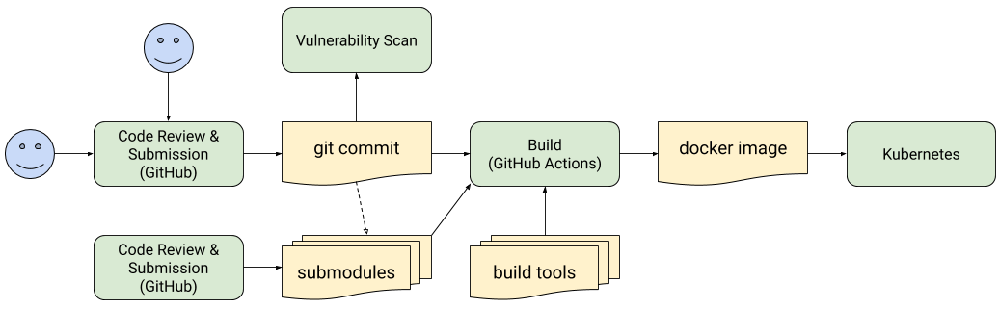

# Motivating use case

> :warning: **These are example predicate types and do not represent real predicates**: please refer to [predicates directory](https://github.com/in-toto/attestation/tree/main/spec/predicates) for real world use cases!

MyCompany wants to centrally enforce the following rules of its production
Kubernetes environments:

-   All containers must undergo a source-level vulnerability scan showing zero
    known high severity vulnerabilities.
-   All first-party code must be peer reviewed, reside in MyCompany's GitHub
    org, and be sufficiently recent.
-   All third-party code and build tools must be verified via Reproducible
    Builds. (Let's pretend such an attestation service exists.)
-   All build steps must be performed by GitHub Actions, Google Cloud Build, or
    AWS CodeBuild in (a hypothetical) "hermetic" mode.
-   The intermediate products in the supply chain have not been tampered with.

It is both too costly and too insecure to have every team write their own
layout. There are several hundred different Kuberenetes environments
administered by many different product teams, none of whom employ security
experts. Instead, we need a solution that allows the central security team to
write a policy that automatically applies to every environment across the
company.

The current in-toto link and layout formats are impractical for this
application:

-   It is awkward to express these concepts in the current link format. One
    would need to either record the exact command lines used, which is too
    brittle, or ignore all of the standard fields and jam everything in
    `environment`, which is hard to use.
-   It is impossible to express this policy in the current layout format.
    -   There is no support for verifying any details. The closest option,
        `expected_command`, is just a warning but not an error.
    -   There is no support for performing generic traversals of the build
        graph, such as "allow any number of verifiable build steps."
-   There is no practical way to analyze a layout to determine if it meets the
    requirements above.

The proposed attestation format, along with a future policy engine, allows us to
craft such a policy. This ITE does not cover the policy engine piece, but we
show the ideas via pseudocode.

## Policy pseudocode

The following pseudocode implements the policy above. Assume that memoization
takes care of cycles. This policy would be written by a security expert at the
company and used for all Kubernetes environments.

```python
policy(artifact):
  lookup attestations for artifact
  allow if (any attestation meets vulnerability_scan and
            any attestation meets first_party_code_review)
  for each attestation meeting verifiable_build:
    allow if (every 'top_level_source' relation meets good_top_level_source and
              every 'dependent_sources' relation meets good_dependent_source and
              every 'tool' relation meets good_tool)
  deny otherwise

good_top_level_source(relation):
  return policy(relation.artifact)

good_dependent_source(relation):
  lookup attestations for relation.artifact
  allow if any attestation meets first_party_code_review
  deny otherwise

good_tool(relation):
  lookup attestations for relation.artifact
  allow if any attestation (meets reproducible_build and
                            attestation.predicate.name == relation.name)
  deny otherwise

vulnerability_scan(attestation):
  attestation is signed by 'MyCompanyScanner'
  attestation.predicateType == 'https://example.com/VulnerabilityScan/v1'
  attestation.predicate.vulnerability_counts.high == 0
  attestation.predicate.timestamp is within 14 days of today

first_party_code_review(attestation):
  attestation is signed by 'GitHub'
  attestation.predicateType == 'https://example.com/CodeReview/v1'
  attestation.predicate.repo_url starts with 'https://github.com/my-company/'
  attestation.predicate.code_reviewed == true
  attestation.predicate.timestamp is within 30 days of today

reproducible_build(attestation):
  attestation is signed by 'ReproducibleBuilds'
  attestation.predicateType == 'https://example.com/ReproducibleBuild/v1'

verifiable_build(attestation):
  return (hermetic_github_action(attestation) or
          hermetic_cloud_build(attestation) or
          hermetic_codebuild(attestation))

hermetic_github_action(attestation):
  attestation is signed by 'GitHubActions'
  attestation.predicateType == 'https://example.com/GitHubActionProduct/v1'
  attestation.predicate.hermetic == true

hermetic_cloud_build(attestation):
  attestation is signed by 'GoogleCloudBuild'
  attestation.predicateType == 'https://example.com/GoogleCloudBuildProduct/v1'
  attestation.predicate.no_network == true

hermetic_cloud_build(attestation):
  attestation is signed by 'AwsCodeBuild'
  attestation.predicateType == 'https://example.com/AwsCodeBuildProduct/v1'
  attestation.predicate.no_network == true

## Types of artifact IDs considered by `lookup attestations for <X>`.
allowed_artifact_id_types = [
  'sha256', 'sha512', 'container_image_digest', 'git_commit',
]
```

## Attestations

Let's take a look at one example team's software supply chain.



-   Top-level code repository is "https://github.com/my-company/my-product".
    -   This defines submodules and the GitHub Actions workflows.
-   Vulnerability scan is provided by an in-house scanner.
-   Docker image is produced by the GitHub Actions "Build" workflow.
    -   In the hypothetical "hermetic" mode, this records all dependent
        submodules and build tools.

This corresponds to the following attestations. Assume each is signed by the
appropriate party; we only show the claim here.

```json
{
  "predicateType": "https://example.com/CodeReview/v1",
  "subject": [{ "git_commit": "859b387b985ea0f414e4e8099c9f874acb217b94" }],
  "predicate": {
    "timestamp": "2020-04-12T13:50:00Z",
    "repo_type": "git",
    "repo_url": "https://github.com/my-company/my-product",
    "repo_branch": "master",
    "code_reviewed": true
  }
}
```

```json
{
  "predicateType": "https://example.com/CodeReview/v1",
  "subject": [{ "git_commit": "2f02c094e6a9afe8e889c3f1d3cb66b437797af4" }],
  "predicate": {
    "timestamp": "2020-04-12T13:50:00Z",
    "repo_type": "git",
    "repo_url": "https://github.com/my-company/submodule1",
    "repo_branch": "master",
    "code_reviewed": true
  }
}
```

```json
{
  "predicateType": "https://example.com/CodeReview/v1",
  "subject": [{ "digest": {"gitCommit": "5215a97a7978d8ee0de859ccac1bbfd2475bfe92" } }],
  "predicate": {
    "timestamp": "2020-04-12T13:50:00Z",
    "repo_type": "git",
    "repo_url": "https://github.com/my-company/submodule2",
    "repo_branch": "master",
    "code_reviewed": true
  }
}
```

```json
{
  "predicateType": "https://example.com/VulnerabilityScan/v1",
  "subject": [{ "git_commit": "859b387b985ea0f414e4e8099c9f874acb217b94" }],
  "predicate": {
    "timestamp": "2020-04-12T13:55:02Z",
    "vulnerability_counts": {
      "high": 0,
      "medium": 1,
      "low": 17
    }
  }
}
```

```json
{
  "predicateType": "https://example.com/GitHubActionProduct/v1",
  "subject": [{ "container_image_digest": "sha256:c201c331d6142766c866..." }],
  "relations": {
    "top_level_source": [{
      "artifact": { "git_commit": "859b387b985ea0f414e4e8099c9f874acb217b94" },
      "git_repo": "https://github.com/example/repo"
    }],
    "dependent_sources": [{
      "artifact": { "git_commit": "2f02c094e6a9afe8e889c3f1d3cb66b437797af4" },
      "git_repo": "https://github.com/example/submodule1"
      }, {
      "artifact": { "git_commit": "5215a97a7978d8ee0de859ccac1bbfd2475bfe92" },
      "git_repo": "https://github.com/example/submodule2"
    }],
    "tools": [{
      "artifact": { "sha256": "411c1dfb3c8f3bea29da934d61a884baad341af8..." },
      "name": "clang"
      }, {
      "artifact": { "sha256": "9f5068311eb98e6dd9bb554d4b7b9ee126b13693..." },
      "name": "bazel"
    }]
  },
  "predicate": {
    "workflow_name": "Build",
    "hermetic": true
  }
}
```

```json
{
  "predicateType": "https://example.com/ReproducibleBuild/v1",
  "subject": [{ "sha256": "411c1dfb3c8f3bea29da934d61a884baad341af8..." }],
  "predicate": {
    "name": "clang"
  }
}
```

```json
{
  "predicateType": "https://example.com/ReproducibleBuild/v1",
  "subject": [{ "sha256": "9f5068311eb98e6dd9bb554d4b7b9ee126b13693..." }],
  "predicate": {
    "name": "bazel"
  }
}
```

## Policy result attestations

It may not be practical to perform attestation chaining at Kubernetes deployment
time due to latency limitations, since the chain of attestations could be
unbounded in length. To work around this limitation, the full policy evaluation
can happen as a step earlier in the software supply chain. That policy
evaluation returns its own attestation proving that the artifact passed the
policy. Then the Kubernetes policy only requires one such attestation.

```python
kubernetes_policy(artifact):
  lookup attestations for artifact
  allow if any attestation meets passed_policy_evaluation
  deny otherwise

passed_policy_evaluation(attestation):
  attestation is signed by 'BinaryAuthorization'
  attestation.predicateType == 'https://example.com/BinAuthzDecision/v1'
  attestation.predicate.decision == 'allow'
  attestation.predicate.timestamp is within 24 hours of now
  attestation.predicate.environment matches this Kubernetes environment

allowed_artifact_id_types = ['container_image_digest']
```

```json
{
  "predicateType": "https://example.com/BinAuthzDecision/v1",
  "subject": [{ "container_image_digest": "sha256:c201c331d6142766c866..." }],
  "predicate": {
    "timestamp": "2020-04-12T18:04:10Z",
    "decision": "allow",
    "environment": {
      "gcp_project": "example-project",
      "cluster": "us-east1-a.prod-cluster"
    }
  }
}
```
